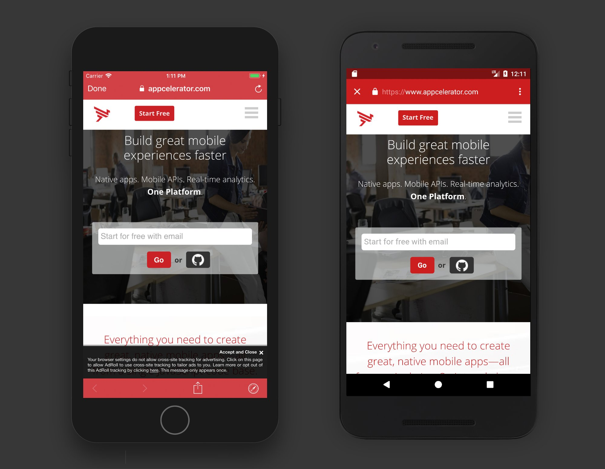

# Titanium Web Dialog

Use the native `SFSafariViewController` (iOS) and `Chrome Pages` (Android) within Axway Titanium. 

## Requirements

- Titanium SDK 7.0.0 or later (or use the [SDK-6-compatibility](https://github.com/appcelerator-modules/titanium-web-dialog/tree/SDK-6-compatibility) Titanium SDK 6.x)
- iOS 9+ and Android 4.1+

## iOS Note

The iOS part of this module is based on Ti.SafariDialog, which has been deprecated for a cross-platform solution. All API's of Ti.SafariDialog
still work here and have been extended by more features over time.

## Android Legacy Support

This module is designed to work with the latest platform API's that are covered by the Titanium SDK 7.0.0 and later.
If you want to use this module in Titanium SDK 6.x, please use the [this version](https://github.com/appcelerator-modules/titanium-web-dialog/raw/SDK-6-compatibility/android/legacy/ti.webdialog-android-1.0.0.zip).

## API's

### Top-Level

#### Methods

* `open(arguments)`
    * `url` (String)
    * `barColor` (String)
    * `animated` (Boolean, iOS only)
    * `entersReaderIfAvailable` (Boolean, iOS only)
    * `barCollapsingEnabled` (Boolean)
    * `title` (String, iOS only)
    * `tintColor` (String, iOS only)
    * `dismissButtonStyle` (`DISMISS_BUTTON_STYLE_*`, iOS only)
    * `showTitle` (Boolean, Android only)
    * `fadeTransition` (Boolean, Android only)
    * `enableSharing` (Boolean, Android only) - Enable Share... menu item to share link
    * `closeIcon` (String, Android only) - image path to show as close-button icon
  
* `isSupported()` -> Boolean
* `isOpen()` (iOS only) -> Boolean
* `close()` (iOS only)

#### Properties

* `DISMISS_BUTTON_STYLE_DONE` (iOS only)
* `DISMISS_BUTTON_STYLE_CLOSE` (iOS only)
* `DISMISS_BUTTON_STYLE_CANCEL` (iOS only)

#### Events

* `open` -> `success` (Boolean), `url` (String)
* `close` -> `success` (Boolean), `url` (String) - iOS only
* `load` -> `success` (Boolean), `url` (String) - iOS only
* `redirect` -> `url` (String) - iOS only

### `AuthenticationSession` (iOS only)

#### Methods

* `createAuthenticationSession(arguments)`
    * `url` (String)
    * `scheme` (String)

#### Events

* `callback` -> `success` (Boolean), `callbackURL` (String)

### `ASWebAuthenticationSession` (iOS 12+ only)

#### Methods

* `createASWebAuthenticationSession(arguments)`
    * `url` (String)
    * `scheme` (String)

#### Events

* `callback` -> `success` (Boolean), `callbackURL` (String)

## License

Apache 2.0

## Author
- [Hans Knöchel](https://github.com/hansemannn)
- [Prashant Saini](https://github.com/prashantsaini1)
